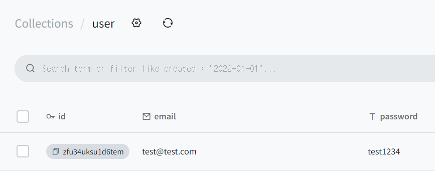

## 🍒 React로 페이지 구현해보기 🍒

---

#### ✔️ 카카오 로그인 페이지 구현🐣

<br/>

##### <결과물>


---

#### ✔️ 구현 코드 및 gif

<br/>

##### 1. input창 클릭시 스타일 변경 및 value 값 받아오기

(input 하이라이트, 로그인 input 클릭시 도움말 생성)
<br/>


<br/>

```js
function Form({ form, setForm }) {
  const [isUserIdInputBottomLine, setIsUserIdInputBottomLine] = useState(false);
  const [isPasswordInputBottomLine, setIsPasswordInputBottomLine] =
    useState(false);

  const handleUserIdInputFocus = () => {
    setIsUserIdInputBottomLine(true);
    setIsPasswordInputBottomLine(false);
  };

  const handlePasswordInputFocus = () => {
    setIsPasswordInputBottomLine(true);
    setIsUserIdInputBottomLine(false);
  };

  const handleInputBlur = () => {
    setIsUserIdInputBottomLine(false);
    setIsPasswordInputBottomLine(false);
  };

  const userIdInputClassName = isUserIdInputBottomLine
    ? `${styles.Input} ${styles.InputBottomLine}`
    : styles.Input;
  const passwordInputClassName = isPasswordInputBottomLine
    ? `${styles.Input} ${styles.InputBottomLine}`
    : styles.Input;
  const addMessageClassName = isUserIdInputBottomLine
    ? styles.AddMessage
    : styles.AddMessageNone;

  return (
    <>
      <form>
        <fieldset className={`${styles.FieldSet}`}>
          <legend className={`${styles.A11yHidden}`}>로그인</legend>
          <input
            type="text"
            label="이메일, 아이디, 전화번호"
            name="userId"
            placeholder="카카오메일 아이디, 이메일, 전화번호"
            className={userIdInputClassName}
            onFocus={handleUserIdInputFocus}
            onBlur={handleInputBlur}
            value={form.id}
            onChange={(event) => {
              setForm((prev) => ({ ...prev, id: event.target.value }));
            }}
          />
          <div className={addMessageClassName}>
            <span className={`${styles.TipText}`}>TIP</span> 카카오메일이 있다면
            메일 아이디만 입력해 보세요.
          </div>
          <input
            type="password"
            label="비밀번호"
            name="userPassword"
            placeholder="비밀번호"
            className={passwordInputClassName}
            onFocus={handlePasswordInputFocus}
            onBlur={handleInputBlur}
            value={form.password}
            onChange={(event) => {
              setForm((prev) => ({
                ...prev,
                password: event.target.value,
              }));
            }}
          />
        </fieldset>
      </form>
    </>
  );
}
```

<br/>

##### 2. 로그인/ QR 로그인 버튼 색상 변경

<br/>

```js
function LoginButtons({ label, name, onClick }) {
  let ColorOption =
    label === "로그인" ? styles.PrimaryColor : styles.SecondaryColor;
  let HoverColor =
    label === "로그인" ? styles.PrimaryHover : styles.SecondaryHover;

  return (
    <div>
      <button
        type="submit"
        className={`${styles.LoginButtons} ${ColorOption} ${HoverColor}`}
        aria-label={label}
        title={label}
        onClick={onClick}
      >
        {name}
      </button>
    </div>
  );
}
```

<br/>

##### 3. 간편 로그인 정보 저장 토글 스타일 및 도움말 보기

<br/>


```js
function SimpleLoginButton() {
  const [check, setCheck] = useState(false);
  const [infoClicked, setInfoClicked] = useState(false);

  return (
    <div className={`${styles.SimpleLoginButton}`}>
      <div
        className={`${styles.SimpleLoginButton}`}
        onClick={() => {
          setCheck(!check);
        }}
      >
        <input
          type="checkbox"
          name="saveLoginInfo"
          className={`${styles.InfoToggle}`}
          value={check}
        />
        <span
          className={`${styles.SimpleLoginIcon} ${
            check
              ? styles.SimpleLoginIconChecked
              : styles.SimpleLoginIconUnchecked
          }`}
        />
        <span className={`${styles.SimpleLogin}`}>간편로그인 정보 저장</span>
      </div>

      <div
        className={`${styles.SimpleLoginImg}`}
        onClick={() => {
          setInfoClicked(!infoClicked);
        }}
      >
        
      </div>
      <div
        className={`${styles.SimpleLoginSaveInfo} ${
          infoClicked ? styles.SimpleLoginSaveInfoClick : ""
        }`}
      >
        로그인한 계정의 정보가 저장됩니다. 개인정보 보호를 위해 개인 기기에서만
        사용해 주세요.
        <a
          href="/"
          className={`${styles.HelpInfo}`}
          onClick={(e) => {
            e.preventDefault();
          }}
        >
          도움말 보기
        </a>
      </div>
    </div>
  );
}
```

<br/>
⚠️ 알게된 점
간편 로그인 토글 버튼를 checkbox 로 구현하였는데 테두리 부분을 border-radius 속성을 이용하여 바꾸려 했는데 적용이 되지 않아 검색해보니 checkbox 는 border style 이 적용이 안 된다는 사실을 알게되었다! 
그래서 apperance: none 을 주었더니 checkbox 의 속성 자체를 잃어버려 테두리는 해결되었으나 체크가 적용되지 않았고 결국 이미지를 불러와 sprite 기법을 사용하여 클릭시 style 을 넣어주는 방식으로 해결하였다..!
<br/>

<br/>
##### 4. pocketbase 사용하여 로그인 기능 구현
<br/>




```js
function LoginForm() {
  const [form, setForm] = useState({
    id: "",
    password: "",
  });

  const [userData, setUserData] = useState();

  useEffect(() => {
    fetch("http://127.0.0.1:8090/api/collections/user/records")
      .then((response) => {
        return response.json();
      })
      .then((response) => {
        setUserData(response);
      });
  }, []);

  const onLogin = () => {
    let isLoginSuccess = false;

    userData.items.forEach((item) => {
      if (item.email === form.id && item.password === form.password) {
        alert("로그인 성공");
        isLoginSuccess = true;
      }
    });

    if (!isLoginSuccess) alert("로그인 실패");
  };
  return (
    <div className={`${styles.LoginForm}`}>
      <div className={`${styles.LoginFormInnerBox}`}>
        {/* Form  */}
        <Form form={form} setForm={setForm} />
        {/* 간편 로그인 */}
        <SimpleLoginButton />
        {/* 로그인 버튼 */}
        <LoginButtons label="로그인" name="로그인" onClick={onLogin} />
      </div>
    </div>
```

---

#### ✔️ 느낀점 및 아쉬운 점

1. 수업 시간에 useState, useEffect 를 사용하는 방법만 배우고 직접 사용해보지 못 해서
   어떻게 쓰는건지 잘 몰랐었는데 이번 과제를 통해 사용하는 방법에 대해 조금은 알게 된 것 같다.

2. 라우터를 사용하여 SPA 를 구현하는 것을 배웠었는데 시간과 실력 이슈로 인해..! 적용해보지 못 한 부분이 아쉽다..!🥲

3. 로그인창을 구현했지만 유효성 검사 코드를 넣어 구현하지 못 하였다.

4. pocktbase 를 사용하여 데이터 통신을 해봤는데 아직 익숙치 않다 보니 data 를 불러오고 세팅 하는 과정에서 시간적 소비가 많았다. 데이터 통신 하는 부분에 대해 아직 잘 모르는 것 같아 pocketbase 를 이용해서 꾸준히 연습해봐야겠다!
